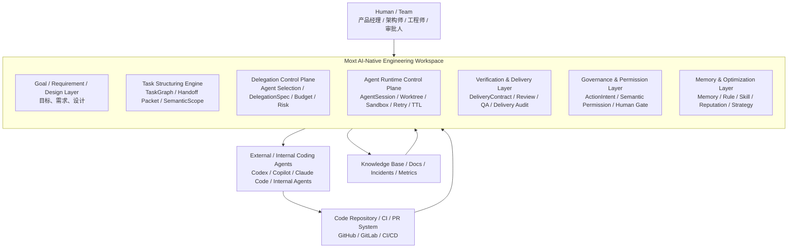
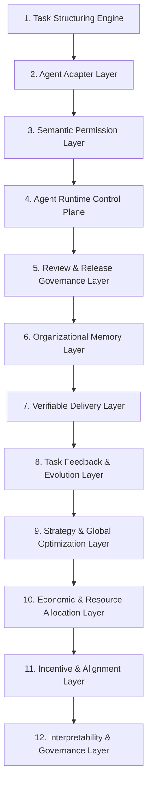
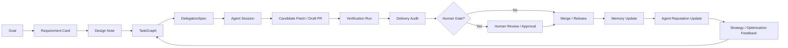
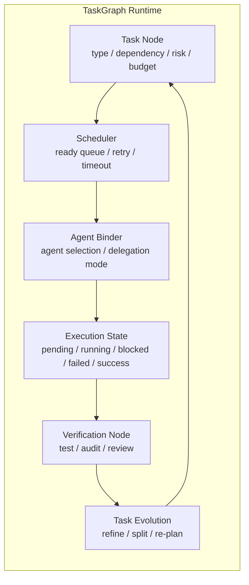
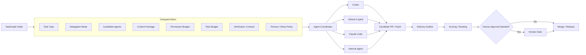
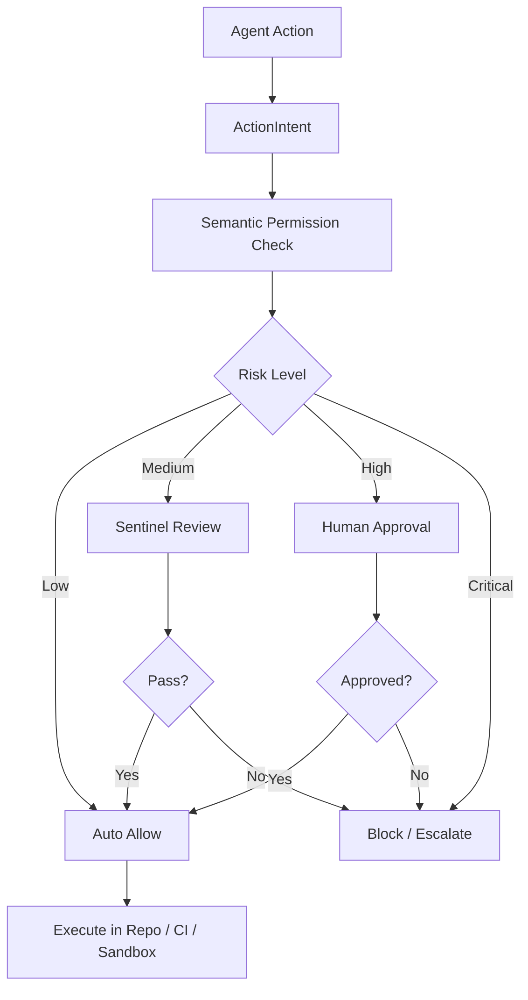
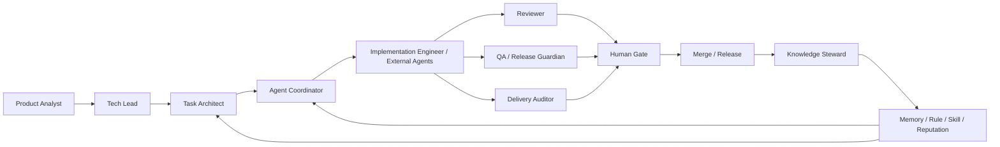
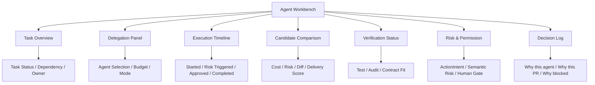

# MOTX / Moxt 软件研发 AI 原生工作空间全量设计 V2

> 本文是基于多轮持续研究沉淀出的累计版设计文档。它不再只是“配置几个 AI 同事”，而是把 Moxt/MOTX 抽象为面向软件研发组织的 **AI Engineering Control Plane**：任务结构化、agent 分派、语义权限、交付验证、风险治理、组织记忆和持续优化的统一工作空间。

---

## 1. 总体定位

Moxt 在软件研发领域不应被定位为另一个 AI coding IDE，也不应直接与 Cursor、Claude Code、Codex、GitHub Copilot 争夺“最佳代码生成体验”。更合理的定位是：

```text
Moxt = AI 软件研发组织控制面
     = Task Structuring + Agent Orchestration + Governance + Organizational Memory
```

也就是说，Moxt 的核心价值不是替代 coding agent，而是管理多个 AI 同事、外部 coding agent 和人类工程师之间的任务、上下文、权限、交付、审查、验证和学习闭环。

### 1.1 Moxt 解决的核心问题

| 问题 | 传统研发表现 | Moxt 应提供的能力 |
|---|---|---|
| 上下文分散 | 需求在 Slack，方案在文档，代码在 PR，决策在会议里 | 统一研发对象图谱 |
| 任务模糊 | 一句话派给 agent，容易跑偏 | TaskGraph + Handoff Packet |
| 权限过粗 | repo/file 权限不足以表达 auth、billing 等语义风险 | Semantic Permission Layer |
| 交付不可验证 | PR 通过测试不等于满足真实目标 | Delivery Contract + Delivery Auditor |
| 多 agent 混乱 | 冲突、重复、幽灵任务、PR 洪水 | Coordinator + Lifecycle Manager |
| 经验不复利 | 每次重复犯错 | Knowledge Steward + Memory/Rule/Skill |
| 系统不可信 | 不知道为什么选 agent、为什么改策略 | Decision Graph + Decision Explainer |

---

## 2. 产品架构：12 层能力模型

Moxt 的最终形态可以抽象为 12 层。

```text
1. Task Structuring Engine
2. Agent Adapter Layer
3. Semantic Permission Layer
4. Agent Runtime Control Plane
5. Review & Release Governance Layer
6. Organizational Memory Layer
7. Verifiable Delivery Layer
8. Task Feedback & Evolution Layer
9. Strategy & Global Optimization Layer
10. Economic & Resource Allocation Layer
11. Incentive & Alignment Layer
12. Interpretability & Governance Layer
```

### 2.1 Task Structuring Engine

把模糊目标转成可执行研发对象。

核心产物：Requirement Card、Design Note、TaskGraph、SemanticScope、Handoff Packet、Acceptance Criteria、Delivery Contract。

核心判断：

```text
AI 工程产出质量 ≈ Task 结构化程度 × 约束完整性 × Agent 能力
```

Moxt 可以控制其中的 Task 质量和约束强度，这是它区别于单点 coding agent 的关键。

### 2.2 Agent Adapter Layer

将 Codex、Claude Code、Copilot、Cursor、内部 agent 统一接入 Moxt。

外部 agent 不应被视为竞争对象，而应被视为可插拔 worker。

核心产物：AgentSession、CapabilityManifest、Agent Cost Profile、Agent Reputation。

### 2.3 Semantic Permission Layer

文件权限不足以表达软件研发风险。Moxt 需要识别语义风险：

```text
auth
billing
payment
permission
migration
data deletion
secrets
infra
compliance logging
audit trail
```

这些语义区域应触发不同级别的 ActionIntent、Security Sentinel、Delivery Auditor 和 Human Gate。

### 2.4 Agent Runtime Control Plane

管理 agent 运行时状态。

核心能力：TTL、heartbeat、budget、kill condition、retry policy、worktree / sandbox 管理、ghost task 清理、PR flood 控制。

### 2.5 Review & Release Governance Layer

把 review、QA、安全、发布从“人手工判断”变成强制状态机。

```text
PR
 → Reviewer
 → QA / Release Guardian
 → Security Sentinel
 → Delivery Auditor
 → Human Gate
 → Merge / Release
```

### 2.6 Organizational Memory Layer

沉淀组织知识，而不是让每个 agent 在临时会话中重新学习。

| 类型 | 内容 | 是否需审批 |
|---|---|---|
| Personal Memory | 个人偏好 | 否 |
| Team Memory | 团队规范 | 是 |
| Project Memory | 项目上下文 | 部分需要 |
| Audit Memory | 决策和审批记录 | 是 |
| Candidate Memory | 待验证经验 | 是，转正后进入长期记忆 |

### 2.7 Verifiable Delivery Layer

不是只跑测试，而是验证 PR 是否真正完成目标。

验证类型：Spec Consistency Check、Scope Boundary Check、Behavioral Validation、Regression & Side-effect Detection、Anti-gaming Check。

### 2.8 Task Feedback & Evolution Layer

识别失败到底来自哪里：

```text
Execution Failure：agent 没做好
Verification Failure：验证规则或覆盖不足
Task Failure：任务定义错误或不完整
```

核心对象：Task Evolution Log。

### 2.9 Strategy & Global Optimization Layer

避免每个 Task 都局部成功，但系统整体架构退化。

核心能力：识别技术债积累、检测模块耦合上升、触发重构策略、动态调整 agent 使用策略、防止局部最优。

### 2.10 Economic & Resource Allocation Layer

引入成本意识，让系统在质量、速度、成本之间做动态权衡。

核心对象：Task Budget、Execution Plan、Agent Cost Profile、Verification Cost Model。

```text
True Efficiency = 有效交付价值 / 总资源消耗
```

### 2.11 Incentive & Alignment Layer

防止 agent 优化错误目标，例如只追求测试通过、PR 数量或低成本。

核心机制：Incentive Profile、Delayed Reward、Cross-Agent Coupling、Reward Hacking Detection。

### 2.12 Interpretability & Governance Layer

让系统决策可解释、可追溯、可审计、可干预。

核心对象：Decision Graph、Decision Explanation、Governance Report、Human Override Record。

### 2.13 架构图

#### 2.13.1 总体分层架构图



#### 2.13.2 12 层能力模型图



#### 2.13.3 核心运行闭环图



#### 2.13.4 TaskGraph Runtime 架构图



#### 2.13.5 可验证委派架构图



#### 2.13.6 权限与治理架构图



#### 2.13.7 AI 同事协作图



#### 2.13.8 Agent Workbench 视图结构图



#### 2.13.9 架构图解读

以上架构图表达了 Moxt 的几个核心设计判断：

1. **Moxt 不是单一 coding agent**：它位于人类团队、外部 agent、代码仓库、CI/CD、知识库之间，本质是研发组织的控制面与工作空间。
2. **TaskGraph 是运行时系统，不是任务清单**：每个任务节点都应带有依赖、风险、预算、候选 agent 和验证要求，可以在执行中被重规划、拆分和演化。
3. **DelegationSpec 是委派层的核心对象**：它把“把任务交给 agent”从口头操作，变成结构化、可追踪、可审计的工程协议。
4. **DeliveryContract 是验证层核心**：系统不是选择“谁先完成”，而是选择“谁最符合交付目标、风险要求和成本约束”。
5. **ActionIntent + Semantic Permission + Human Gate 构成治理闭环**：高风险动作不能直接执行，必须在权限、风险和审批边界内运行。
6. **Memory / Reputation / Strategy 构成复利层**：每次任务执行都会反哺组织知识，系统会逐步学会什么任务适合什么 agent、什么模式高风险、什么验证最有效。

---

## 3. AI 同事体系设计

### 3.1 不建议一开始配置 18 个 AI 同事

多轮研究已经推导出较完整角色谱系，但企业落地时不应一开始创建过多角色。建议分为：

```text
MVP 核心 7 个 AI 同事
+ 扩展治理型角色
+ 外部 Agent Adapter
```

### 3.2 MVP 推荐 7 个 AI 同事

| AI 同事 | 核心职责 | 主要输出 |
|---|---|---|
| Product Analyst | 把用户目标和反馈转成需求 | Requirement Card |
| Tech Lead | 把需求转成设计和风险边界 | Design Note / SemanticScope |
| Task Architect | 把目标拆成 agent 可执行任务 | TaskGraph / Handoff Packet |
| Implementation Engineer | 执行受控代码修改 | Branch / Draft PR / Patch |
| Reviewer | 审代码质量和局部逻辑 | Review Verdict |
| QA / Release Guardian | 测试策略、发布准备和回滚检查 | Test Plan / Release Readiness |
| Knowledge Steward | 沉淀组织记忆和规则 | Memory / Rule / Runbook |

### 3.3 企业增强版角色

| AI 同事 | 何时引入 | 价值 |
|---|---|---|
| Coordinator | 多 agent 并行开始混乱时 | 调度、锁、状态机 |
| Security & Compliance Sentinel | 涉及生产、权限、安全、合规时 | 高风险动作守门 |
| Lifecycle Manager | agent 长任务增多时 | TTL、kill fast、资源回收 |
| Delivery Auditor | AI PR 数量增多后 | 验证是否真正完成目标 |
| Task Critic | 任务反复失败时 | 识别 task failure |
| Strategy Planner | 多模块、多团队规模化后 | 全局策略优化 |
| Architecture Governor | 技术债和耦合上升时 | 架构边界治理 |
| Resource Allocator | 成本变成问题时 | 预算和资源分配 |
| Incentive Designer | agent 出现刷指标行为时 | 行为对齐 |
| Decision Explainer | 系统决策不透明时 | 决策解释 |
| Governance Auditor | 企业合规场景 | 审计与治理 |

### 3.4 Agent Adapter 不是 AI 同事

Agent Adapter 是外部 coding agent 适配层，用于接入 Codex、Claude Code、GitHub Copilot coding agent、Cursor、内部脚本 agent。

它负责把外部 agent 的任务、日志、diff、测试、成本、风险统一映射到 Moxt 的对象协议。

---

## 4. 核心研发对象协议

Moxt 工作空间不应只管理文档，而应管理研发对象。

### 4.1 核心对象列表

```text
Goal
Requirement
Design
TaskGraph
Task
SemanticScope
Handoff Packet
AgentSession
ActionIntent
Patch
Pull Request
TestRun
PRRiskProfile
DeliveryContract
DeliveryAudit
ReleaseCandidate
Release
Incident
Memory
Rule
Skill
TaskEvolutionLog
StrategySnapshot
ExecutionPlan
IncentiveProfile
DecisionGraph
GovernanceReport
DelegationSpec
ControlContract
SolutionSet
StrategyMemory
ExperienceRecord
```

### 4.2 统一对象元数据

```yaml
id: unique_id
type: Requirement | Task | PR | Memory | Rule | Skill | ...
owner: human | ai_teammate | external_agent
status: draft | proposed | approved | in_progress | blocked | done | archived
source: human_input | github | slack | web | ci | meeting | ai_generated
confidence: low | medium | high
risk_level: low | medium | high | critical
last_verified_at: timestamp
linked_objects:
  - upstream_goal
  - requirement
  - design
  - issue
  - pr
  - test
  - release
human_approval_required: true | false
```

### 4.3 Handoff Packet

Handoff Packet 是 Moxt 分派给内部或外部 agent 的标准任务包。

```yaml
handoff_id: HOFF-2026-0502-001
source_goal: GOAL-xxx
requirement_id: REQ-xxx
design_id: DESIGN-xxx
task_id: TASK-xxx
agent_target:
  role: ImplementationEngineer
  backend_candidates:
    - codex
    - claude_code
    - copilot_agent
scope:
  allowed_modules:
    - packages/billing-ui
  forbidden_modules:
    - packages/auth
    - infra/production
    - migrations
semantic_risk:
  risk_level: medium
  sensitive_domains:
    - billing_ui
acceptance_criteria:
  - 用户可以完成目标操作
  - 新增或更新对应测试
  - 不得修改非授权模块
output_contract:
  expected_artifacts:
    - draft_pr
    - implementation_summary
    - test_result
rollback:
  expected_strategy: revert single PR
budget:
  max_runtime_minutes: 45
  max_diff_files: 12
  max_retry_count: 2
```

### 4.4 ActionIntent

所有高风险工具调用必须先结构化为 ActionIntent。

```yaml
ActionIntent:
  id: action_123
  actor: ImplementationEngineer
  target_objects:
    - task_456
  environment: staging
  action_type: schema_migration
  risk_level: high
  requires_approval: true
  dry_run_available: true
  rollback_plan_required: true
  credentials_scope: staging_only
  sentinel_status: pending_review
```

### 4.5 Delivery Contract

Delivery Contract 定义“什么才算完成”。

```yaml
delivery_contract:
  success_definition:
    - 用户可以完成 X 操作
    - 系统返回 Y 结果
  invariants:
    - 不得影响 auth flow
    - billing calculation 不变
  anti_patterns:
    - 禁止 hardcode response
    - 禁止修改测试以绕过失败
  verification_methods:
    - type: unit_test
    - type: integration_test
    - type: scenario_simulation
    - type: static_analysis
  confidence_score_required: 0.85
```

### 4.6 Decision Graph

Decision Graph 记录关键决策的因果链。

```yaml
decision_graph:
  nodes:
    - task_v3
    - agent_selection_codex
    - verification_upgrade
    - policy_update_billing
  edges:
    - from: task_v2
      to: task_v3
      reason: refined acceptance criteria
    - from: billing_failures
      to: verification_upgrade
```

---

## 5. 软件研发新作业范式

### 5.1 核心范式

```text
Goal-driven, object-mediated, agent-executed, system-verified, human-governed software development.
```

中文表达：

```text
目标驱动、对象承载、AI 执行、系统验证、人类治理的软件研发范式。
```

### 5.2 端到端流程

```text
Goal
 → Product Analyst 生成 Requirement
 → Tech Lead 生成 Design
 → Task Architect 生成 TaskGraph / Handoff Packet
 → Security Sentinel 标记风险
 → Coordinator 分派 AgentSession
 → Implementation Engineer / 外部 Agent 执行
 → Reviewer 审代码质量
 → QA / Release Guardian 验证测试与发布准备
 → Delivery Auditor 验证真实交付
 → Human Gate 审批高风险节点
 → Knowledge Steward 沉淀记忆
 → Lifecycle Manager 清理会话与资源
 → Strategy / Economic / Incentive / Governance 层周期性优化系统
```

### 5.3 与传统研发的区别

| 传统研发 | Moxt AI 原生研发 |
|---|---|
| 人类在工具之间搬上下文 | Moxt 维护研发对象图谱 |
| 任务由自然语言粗略描述 | TaskGraph / Handoff Packet 结构化描述 |
| AI 产物是代码片段 | AI 产物是可审查、可验证、可回滚的 PR |
| Review 主要靠人类 | AI 预审 + 人类关键判断 |
| 测试是后置环节 | Delivery Contract 前置定义 |
| 经验存在脑子里 | Memory / Rule / Skill 持续沉淀 |
| 权限按仓库/文件控制 | 语义权限 + ActionIntent + Human Gate |

---

## 6. 权限与治理模型

### 6.1 自治等级

| 等级 | 名称 | 能做什么 | 默认适用 |
|---|---|---|---|
| L1 | Draft-only | 只生成草稿和建议 | Product Analyst / Tech Lead |
| L2 | Comment / Issue | 创建 issue、评论、checklist | Reviewer / QA / Security |
| L3 | Branch-write | 在受控分支改代码 | Implementation Engineer |
| L4 | Workflow-trigger | 触发测试、预览、扫描 | QA / Coordinator |
| L5 | Human-approved Execution | 准备高风险操作，但必须审批 | Release / Security |

### 6.2 高风险动作默认规则

以下操作默认不能由 AI 自主执行：

```text
merge main
production deploy
database migration
permission change
secret rotation
billing/payment operation
user data export/deletion
cloud resource deletion
audit log modification
```

### 6.3 语义风险触发规则

一旦触及以下领域，必须提升风险等级：

```text
auth
billing
payment
permission
data deletion
migration
secrets
infra
compliance
audit trail
```

---

## 7. 评价体系

### 7.1 总体指标

```text
有效研发吞吐 = 可并行任务数 × 单任务成功率 × 审查通过率 ÷ 协调成本
True Efficiency = 有效交付价值 / 总资源消耗
Alignment Efficiency = 正确行为比例 / 总行为数
Task Convergence Efficiency = 成功任务数 / 平均 Task 迭代次数
Debug Efficiency = 问题定位时间 / 总问题数
```

### 7.2 关键生产指标

- Goal 到 merged PR 的 lead time
- PR 首次 CI 通过率
- PR 合并率
- Review 轮次
- 人类修改比例
- defect escape rate
- rollback rate
- cost per accepted change
- scope violation 次数
- reward hacking 次数
- human override 次数
- explanation coverage
- governance violation 次数

### 7.3 Agent Reputation

每个 agent backend 都应有组织内信誉画像：

```yaml
agent_reputation:
  codex:
    strong_domains:
      - api task
      - small fix
    weak_domains:
      - large refactor
    reliability: 0.82
    avg_cost: medium
    cheating_risk: low
```

---

## 8. 建议仓库规范：`.moxt/`

Moxt 如果要落地到真实工程项目，建议在仓库中引入 `.moxt/` 目录。

```text
.moxt/
  project.yaml
  agents/
    product-analyst.yaml
    tech-lead.yaml
    task-architect.yaml
    reviewer.yaml
    qa-guardian.yaml
    security-sentinel.yaml
  handoff/
    HOFF-*.yaml
  taskgraph/
    TG-*.yaml
  delivery-contract/
    DC-*.yaml
  risk-budget/
    RB-*.yaml
  decision-log/
    DG-*.yaml
  memory/
    candidate/
    approved/
  policies/
    semantic-permissions.yaml
    governance-policy.yaml
    human-gates.yaml
```

### 8.1 最小可行闭环

MVP 不需要一次性实现所有层。建议先实现：

```text
Requirement Card
→ TaskGraph
→ Handoff Packet
→ Draft PR
→ Review Checklist
→ Delivery Contract
→ SUMMARY / Memory Update
```

---

## 9. 落地路线图

### 阶段 1：记录与结构化

目标：把研究和研发过程从聊天沉淀为文件。

交付：Requirement Card 模板、TaskGraph 模板、Handoff Packet 模板、SUMMARY 索引。

### 阶段 2：AI 同事 MVP

目标：配置 5-7 个核心 AI 同事。

推荐：Product Analyst、Tech Lead、Task Architect、Implementation Engineer、Reviewer、QA / Release Guardian、Knowledge Steward。

### 阶段 3：接入 GitHub 工作流

目标：形成 issue → branch → draft PR → review → test → memory 的闭环。

交付：GitHub issue 模板、PR 模板、Review checklist、Delivery Contract、Human Gate 规则。

### 阶段 4：治理与安全

目标：引入 Security Sentinel、Semantic Permission、ActionIntent、RiskBudget。

交付：semantic-permissions.yaml、risk-budget.yaml、action-intent.yaml、security review policy。

### 阶段 5：系统优化

目标：引入 Strategy、Economic、Incentive、Interpretability 层。

交付：Agent Reputation、Decision Graph、Incentive Profile、Strategy Snapshot、Governance Report。

---

## 10. 阶段性结论

Moxt 在软件研发里的核心机会不是“做一个更强的程序员”，而是“做一个可信的 AI 研发组织操作系统”。

它的核心资产不是单个模型能力，而是：

```text
研发对象协议
AI 同事角色体系
Agent Adapter
TaskGraph
Handoff Packet
Semantic Permission
ActionIntent
Delivery Contract
Task Evolution Log
RiskBudget
Decision Graph
Organizational Memory
```

最终抽象：

```text
Moxt = 可执行 + 可验证 + 可收敛 + 可优化 + 可对齐 + 可解释 的工程系统
```

或者更简洁地说：

```text
Moxt 是一个在有限资源和受控风险下，持续逼近软件研发最优解的组织操作系统。
```
